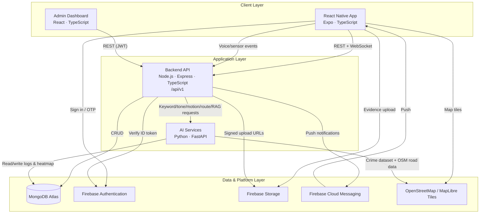
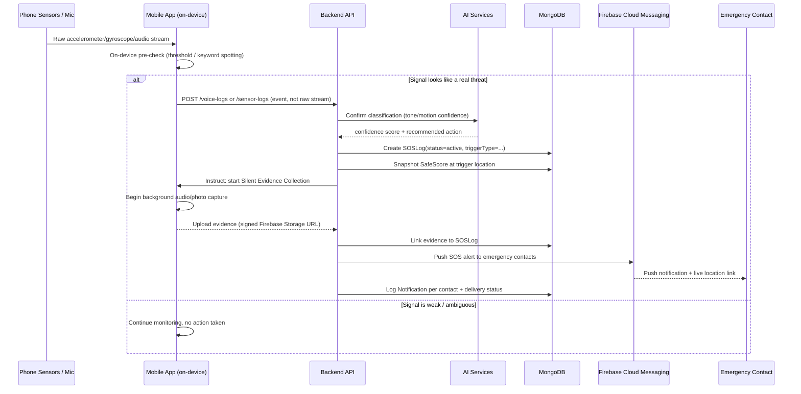

# SafeSathi — System Architecture

## 1. Design Philosophy

SafeSathi is built as a **monorepo of four independently deployable
services** that share a common data layer (MongoDB Atlas) and identity
provider (Firebase). This gives the project two things a final-year
submission needs at once: the clean separation of a real production system,
and a single repository that's easy to evaluate and demo.

Guiding principles, applied consistently across every service:

- **Clean Architecture** — dependencies point inward. Route handlers know
  about controllers; controllers know about services; services know about
  repositories; nothing outside the `models/` layer knows about Mongoose
  directly. This means the persistence layer (MongoDB) or even the delivery
  mechanism (Express) could be swapped without rewriting business logic.
- **SOLID**
  - *Single Responsibility* — a controller only translates HTTP ↔ service
    calls; a service only holds business rules; a repository only holds
    query logic.
  - *Open/Closed* — new SOS trigger types (e.g. a future wearable-device
    trigger) extend the `SOSTriggerType` union and a new service method,
    without modifying existing trigger handling.
  - *Liskov / Interface Segregation* — repositories are defined against
    narrow interfaces (`IEmergencyContactRepository`, not a generic
    `IRepository<T>` grab-bag) so consumers only depend on what they use.
  - *Dependency Inversion* — services depend on repository **interfaces**,
    with concrete Mongoose implementations injected at the composition
    root (`src/config/container.ts`, built in Phase 2).
- **Repository Pattern** — all MongoDB access goes through a repository;
  controllers and services never import a Mongoose model directly.
- **API versioning** — every backend route is namespaced under `/api/v1`,
  so breaking changes in the future ship as `/api/v2` without breaking the
  deployed mobile app.
- **Environment-driven config** — no secret or environment-specific value
  is hard-coded; everything comes from `.env` (see each service's
  `.env.example`).

## 2. High-Level System Diagram



## 3. Service Responsibilities

| Service | Responsibility | Talks to |
|---|---|---|
| `mobile-app` | End-user experience: onboarding, profile, SOS, live location, safe route, heatmap, evidence capture, chatbot, fake call, community alerts | `backend` (REST/WebSocket), Firebase Auth/Storage/FCM directly, OSM tiles directly |
| `backend` | Single source of truth for all app data; auth verification; orchestrates SOS pipeline; talks to AI service for intelligence; talks to Firebase for identity/storage/push | MongoDB Atlas, Firebase Admin SDK, `ai-services` |
| `ai-services` | All ML/AI workloads: Vosk keyword spotting, librosa tone analysis, motion-event classification, SafeScore computation, safe-route scoring, heatmap generation, RAG chatbot | MongoDB Atlas (reads logs, writes heatmap/route results), `backend` (callbacks) |
| `admin-dashboard` | Internal tool for moderators/analysts: verify reports, monitor live SOS events, manage users, view analytics & heatmaps, export CSV | `backend` only, via a separate JWT-authenticated admin API surface |

Only the **backend** talks to MongoDB *and* is reachable from the public
internet by the mobile app and admin dashboard. `ai-services` is an
internal service (not exposed to end users) reached only by the backend,
which keeps the ML workloads swappable and independently scalable.

## 4. Authentication Strategy

Two separate identity systems, matching the two separate audiences:

- **End users (mobile app) → Firebase Authentication.**
  Registration, login, OTP verification, and forgot-password are all
  handled client-side by the Firebase Auth SDK (phone-number OTP for
  registration/login, email/password as a secondary method, Firebase's
  built-in password-reset email flow). The mobile app never talks to our
  own backend to authenticate — it only ever sends a **Firebase ID token**
  in the `Authorization: Bearer <token>` header. The backend verifies that
  token per-request using the `firebase-admin` SDK
  (`src/middlewares/auth.middleware.ts`, built in Phase 2) and resolves it
  to a `User` document via `firebaseUid`. This avoids re-implementing
  password storage, OTP delivery, and session security — Firebase already
  solves this correctly.

- **Admins (admin dashboard) → self-issued JWT.**
  Admins are not Firebase users; they're rows in the `Admins` collection
  with a bcrypt-hashed password, created out-of-band by a super admin. The
  admin dashboard calls `POST /api/v1/admin/auth/login`, the backend
  verifies the password and issues a short-lived JWT
  (`JWT_SECRET`/`JWT_EXPIRES_IN` from `.env`), and every subsequent admin
  request carries that JWT. This matches the spec's explicit requirement
  of "Admin Login — JWT Authentication" and keeps admin credentials
  entirely outside the Firebase project used by end users.

## 5. Backend — Clean Architecture Layers

```
HTTP Request
   │
   ▼
routes/            → maps HTTP verb + path to a controller method, applies
                      route-level middleware (auth, rate limit, validation)
   │
   ▼
controllers/        → parses/validates request, calls one service method,
                       shapes the HTTP response. No business logic here.
   │
   ▼
services/            → business logic and orchestration (e.g. "trigger SOS"
                        = create SOSLog + notify contacts + push evidence
                        capture instruction — all here, not in the controller)
   │
   ▼
repositories/         → the only layer that imports Mongoose models;
                         one repository per collection, narrow interface
   │
   ▼
models/                → Mongoose schemas — pure data shape, no business logic

Cross-cutting (used from any layer, injected not imported-and-called-directly
where possible):
config/        → env loading, DB connection, Firebase Admin init, DI container
middlewares/   → auth, error handler, rate limiter, request logger, validator
utils/         → pure helper functions (geo math, formatting, constants)
types/         → shared TypeScript interfaces/enums (mirrors the Mongoose types)
validators/    → Zod schemas for every request body/query/params
```

### Backend folder structure

```
backend/
├── src/
│   ├── config/
│   │   ├── env.ts                 → typed, validated process.env wrapper
│   │   ├── database.ts             → Mongoose connection with retry
│   │   ├── firebase.ts              → firebase-admin initialization
│   │   └── container.ts              → dependency-injection composition root
│   ├── models/                       → Mongoose schemas (delivered in this phase)
│   │   ├── User.model.ts
│   │   ├── EmergencyContact.model.ts
│   │   ├── SOSLog.model.ts
│   │   ├── Location.model.ts
│   │   ├── VoiceLog.model.ts
│   │   ├── SensorLog.model.ts
│   │   ├── Report.model.ts
│   │   ├── Heatmap.model.ts
│   │   ├── Notification.model.ts
│   │   ├── Route.model.ts
│   │   ├── ChatHistory.model.ts
│   │   ├── Admin.model.ts
│   │   └── index.ts
│   ├── repositories/                  → one per collection (Phase 2)
│   ├── services/                       → auth, user, contact, sos, location,
│   │                                      voice, sensor, report, heatmap,
│   │                                      route, chat, notification, admin,
│   │                                      analytics (Phase 2 onward)
│   ├── controllers/                     → one per route group (Phase 2 onward)
│   ├── routes/                           → one per route group + v1 index (Phase 2)
│   ├── middlewares/                       → auth, adminAuth, errorHandler,
│   │                                         rateLimiter, requestLogger,
│   │                                         validateRequest (Phase 2)
│   ├── validators/                         → Zod schemas per route group (Phase 2)
│   ├── types/
│   │   └── common.types.ts                → shared GeoJSON types (delivered now)
│   ├── utils/                               → logger (winston), geo helpers,
│   │                                          apiResponse formatter, AppError
│   ├── app.ts                                → Express app assembly (Phase 2)
│   └── server.ts                              → process entry point (Phase 2)
├── tests/                                      → Jest unit + Supertest API tests (Phase 8)
├── package.json
├── tsconfig.json
└── .env.example
```

## 6. Mobile App Folder Structure

```
mobile-app/
├── src/
│   ├── screens/          → one folder per feature (Auth, Onboarding, Home,
│   │                        Profile, Contacts, SOS, LiveLocation, SafeRoute,
│   │                        Heatmap, ReportIncident, CommunityAlerts, Chatbot,
│   │                        FakeCall, Settings) — built Phase 3–7
│   ├── navigation/         → RootNavigator, AuthStack, AppStack, TabNavigator
│   ├── components/          → reusable UI: buttons, cards, SOS button,
│   │                          SafeScore gauge, skeletons, empty/error states
│   ├── store/                 → Redux Toolkit: store.ts + one slice per domain
│   │                            (authSlice, userSlice, contactsSlice, sosSlice,
│   │                            locationSlice, heatmapSlice, chatSlice...)
│   ├── services/                → axios client, per-domain API modules,
│   │                              background-task registration (voice/motion),
│   │                              Firebase (auth, storage, messaging) wrappers
│   ├── hooks/                     → useAuth, useLocation, useSOS,
│   │                                useBackgroundDetection, useSafeScore
│   ├── types/                       → TS interfaces mirroring backend DTOs
│   ├── constants/                     → colors, theme, keyword lists, config
│   └── assets/                         → icons, Lottie JSON, fonts
├── app.json / app.config.ts               → Expo config (Phase 3)
├── package.json
├── tsconfig.json
└── .env.example
```

## 7. AI Services Folder Structure

```
ai-services/
├── app/
│   ├── api/           → FastAPI routers: /voice, /tone, /motion, /saferoute,
│   │                     /heatmap, /chat, /safescore — one router per capability
│   ├── services/        → business logic: VoskKeywordService, ToneAnalysisService,
│   │                      MotionClassifierService, SafeScoreService,
│   │                      RouteScoringService, HeatmapService, RagChatService
│   ├── models/            → Pydantic request/response schemas
│   ├── core/                → settings (pydantic-settings), Mongo client (motor),
│   │                          model loading/caching (Vosk models per language)
│   └── utils/                  → audio preprocessing, geo helpers
├── models/                       → downloaded Vosk model binaries (git-ignored,
│                                    fetched by a setup script in Phase 5)
├── main.py                        → FastAPI app entry point (Phase 5)
├── requirements.txt
└── .env.example
```

## 8. Admin Dashboard Folder Structure

```
admin-dashboard/
├── src/
│   ├── pages/            → Login, Overview/Analytics, Users, Reports,
│   │                        LiveSOS, Heatmaps, Exports (Phase 7)
│   ├── components/         → DataTable, ChartCard, MapPanel, Sidebar, Topbar
│   ├── services/             → axios client with JWT interceptor
│   ├── store/                  → Redux Toolkit (or React Query — decided in Phase 7)
│   ├── hooks/                    → useAdminAuth, useAnalytics
│   ├── types/                      → TS interfaces mirroring backend DTOs
│   └── constants/                    → theme, route paths
├── package.json
├── tsconfig.json
└── (vite.config.ts, tailwind.config.js — added Phase 7)
```

## 9. Cross-Cutting Concerns

- **Error handling** — every service layer throws a typed `AppError(code,
  httpStatus, message)`; a single Express error-handling middleware
  converts it to the standard error envelope (see `API_DESIGN.md §2`).
  AI-service errors use FastAPI's `HTTPException` with the same error-code
  vocabulary so the mobile app handles both uniformly.
- **Logging** — `winston` (backend) / Python `logging` (AI service) with
  structured JSON logs in production and pretty console logs in
  development; `morgan` for HTTP access logs, piped into winston.
- **Validation** — every request body is validated at the edge (Zod on the
  backend, Pydantic on the AI service) before it reaches business logic.
- **Security** — `helmet` for HTTP headers, `express-rate-limit`
  (per-IP and per-user tiers — SOS-related endpoints are exempted from
  aggressive throttling), CORS locked to known origins, all secrets in
  environment variables, Firebase Security Rules restrict Storage access
  to a user's own evidence files plus admin service accounts.
- **API versioning** — `/api/v1/*` now; a new major version is a new
  parallel route namespace, never a breaking change to `v1`.

## 10. Real-Time & Background Considerations

- **Live location sharing** uses a WebSocket channel (`socket.io`) in
  addition to REST: the mobile app streams location updates while sharing
  is active, and the backend fans them out to whichever family members are
  currently viewing that user's live map (falls back to REST polling if a
  socket connection isn't available).
- **Background detection** (voice keyword + motion) runs primarily
  **on-device** on the mobile app via `expo-task-manager` /
  `expo-background-fetch`, so the app keeps listening even when
  backgrounded. Only *events* (a detected keyword, a motion classification)
  are sent to the backend — continuous raw audio/sensor streams are never
  uploaded, both for battery/bandwidth reasons and to minimize what's
  transmitted from a phone that may currently be in a dangerous situation.
  Raw audio is only captured and uploaded when Silent Evidence Collection
  is actively triggered by a real SOS event.
- **Push notifications** (SOS alerts to emergency contacts, community
  alerts, report status updates) go through Firebase Cloud Messaging, with
  SMS as a documented fallback path for contacts who don't have the app
  installed (implemented in Phase 4).

## 11. Auto-SOS Pipeline (Critical Path)

This is the flow every AI-detection module (voice, tone, motion) ultimately
feeds into:



## 12. Key Architectural Assumptions

Documented here so they're explicit rather than implicit — flag any of
these if they should change before Phase 2 begins:

1. **Monorepo, not four separate repositories** — simpler for academic
   submission and evaluation; each service still deploys independently.
2. **MongoDB's default model-name pluralization** is used for collection
   names (`User` → `users`, `SOSLog` → `soslogs`, etc.), which matches the
   spec's collection list.
3. **Motion/voice classification runs primarily on-device**, with the
   Python AI service used for the heavier/optional confirmation pass,
   safe-route scoring, heatmap generation, and the RAG chatbot — this
   keeps the always-on background detection working without a live network
   connection and keeps battery/bandwidth usage low.
4. **Admin accounts are seeded manually** (no public admin registration
   endpoint), consistent with "Build a completely separate admin
   dashboard."
