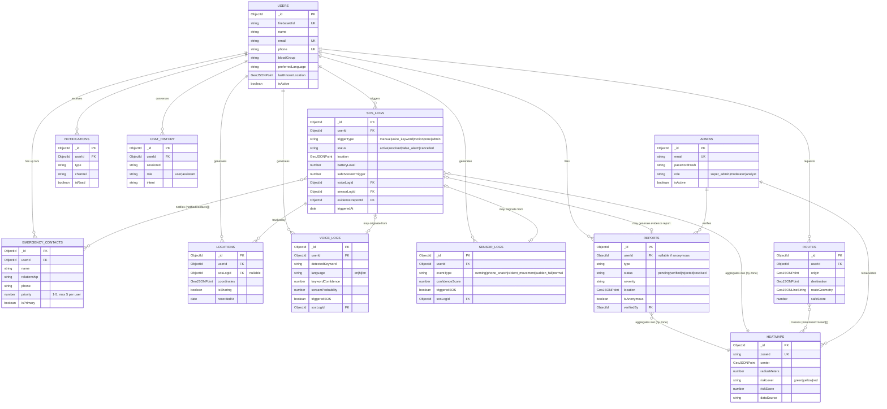

# SafeSathi — Entity-Relationship Diagram

MongoDB is document-based, so these are logical relationships expressed via
`ObjectId` references (Mongoose `ref`), not enforced foreign keys. Full
field lists live in `backend/src/models/*.model.ts` — this diagram shows
primary/foreign keys and the fields that matter for understanding the
relationships.

## Notes on Relationships

- **EmergencyContacts (max 5 per user)** — capped at the service layer
  (not the schema layer), because enforcing "at most N" requires a count
  query against existing documents, which belongs in
  `EmergencyContactService.addContact()`, not in the Mongoose schema.
- **SOSLog ↔ VoiceLog/SensorLog** is optional-to-optional: a manually
  triggered SOS has neither; an AI-triggered SOS has exactly one.
- **Report → Heatmap** and **SOSLog → Heatmap** are *aggregation*
  relationships, not direct foreign keys — the `HeatmapService` (Phase 6)
  periodically recomputes each zone's `riskScore`/`riskLevel` from the
  reports and SOS logs that fall within it, rather than each `Report`
  storing a live `heatmapId`.
- **Route → Heatmap (riskZonesCrossed)** records which zones a *computed*
  route passed through, for explainability ("this route was scored lower
  because it crosses 2 red zones").
