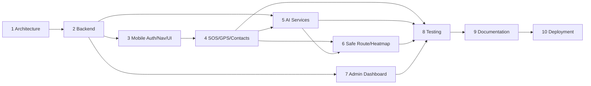

# SafeSathi — Development Roadmap

Sequenced exactly as agreed for this build, with an indicative week range
against a ~22-week (two-semester) final-year project timeline. Each phase
ends with backend, frontend, database, and documentation all updated
together, per the project's development rules — no phase leaves a
dangling half-implemented feature for the next one to discover.

| Phase | Scope | Weeks | Key Deliverables |
|---|---|---|---|
| **1** | Architecture & planning | 1–2 | Folder structure, DB schema (Mongoose models), API design, ER diagram, wireframes, roadmap, git strategy, dependency list — **this delivery** |
| **2** | Backend (Express + MongoDB + Firebase Auth) | 3–5 | Backend foundation (config, logging, error handling, rate limiting, both auth strategies) + the always-needed core API: auth, user profile, emergency contacts, **SOS trigger/resolve/history/im-safe with real contact notification**, notifications, admin login. Voice/sensor logs, reports, community alerts, safe-route, heatmap, chat, and admin user/report/heatmap management are deferred to Phases 5–7 below, where the AI service or admin UI that gives them meaning is actually being built alongside them — see `docs/architecture/API_DESIGN.md` for the full surface and its per-phase status. |
| **3** | React Native app — auth, navigation, UI | 6–8 | ✅ Splash, onboarding, register/login/Firebase phone-OTP, a design system built around one signature interaction (the SOS hold button), reusable component library, Profile/Contacts/Settings screens. Bottom-tab shell (Home/Map/Chat/Profile) stays a single stack until Map and Chat have real screens in Phases 5–6 — see `mobile-app/src/navigation/AppNavigator.tsx`. |
| **4** | SOS, GPS, contacts, notifications | 9–10 | ✅ Live location sharing (REST + Socket.IO, auth'd via Firebase ID token over the socket handshake), auto-started/stopped around the SOS lifecycle and available standalone; native FCM push-token registration and notification-tap routing; continuous foreground GPS streaming during an active SOS. No embedded map yet — Phase 6 builds one shared MapLibre component for live location, Safe Route, and the Heatmap together, since MapLibre needs a custom native build regardless of which feature uses it first. |
| **5** | AI services (Vosk, tone detection, motion detection) | 11–13 | ✅ FastAPI service — librosa tone/scream analysis (verified against synthetic audio, including a real ffmpeg-decode fix caught by that testing), a RandomForest motion classifier **actually trained** in this build (97.7% test accuracy, 97.5%±0.5% 5-fold CV — see `ai-services/README.md` for the real run output), SafeScore service implementing the documented formula, and real Vosk integration for English/Hindi (Bengali is a documented upstream gap — AlphaCephei's classic model links are dead, see `ai-services/README.md §3`). Backend `/voice-logs` and `/sensor-logs` wired end-to-end: submit → AI service call → auto-SOS trigger when a keyword/scream/motion signature crosses threshold, same pipeline as manual trigger. Mobile-side on-device detectors (`useMotionDetector`, `useVoiceDetector`) built and type-checked; motion detection is pure JS (fully exercised), voice detection's recording behavior is not yet smoke-tested on a real device (see `mobile-app/README.md`). The AI chatbot (RAG) isn't part of this phase's title and is deferred to Phase 6. |
| **6** | Safe route and heatmap | 14–15 | ✅ Backend — Reports (with proactive community-alert notification on creation), Heatmap (real Report/SOSLog density aggregated into risk zones via a fixed-degree grid), Safe Route (candidate paths scored by a shared `/internal/safescore/batch` endpoint; candidate *geometry* is a documented straight-line simplification, not real road routing — see `RouteService`'s scope note for the production upgrade path). Mobile — all four screens (Report Incident, Community Alerts, Safe Route, Risk Zones) built and wired to the live backend, list/badge-based UI. Embedded map rendering (MapLibre) and the bottom-tab navigation shell are deferred as a follow-up — MapLibre needs a custom native build this environment can't verify. |
| **7** | Admin dashboard | 16–17 | 🟡 Backend complete — analytics (overview/SOS-trend/peak-timings), user management (list/search/deactivate), report moderation (list/verify/reject), live+historical SOS monitor, heatmap management (list-all + wide-area recalculate), CSV export, and a monthly JSON summary. Role-gated: read endpoints work for any admin, mutations need `super_admin`/`moderator`. The React admin dashboard frontend to actually consume this API is the remaining piece. |
| **8** | Testing and debugging | 18–19 | Unit tests, API/integration tests (Jest + Supertest), error-handling tests, bug-fix pass across all services |
| **9** | Documentation (SRS, synopsis, report, diagrams, README) | 20 | SRS, synopsis, full project report, use-case & sequence diagrams, installation/deployment/testing/developer guides, user manual |
| **10** | Deployment (Render, Vercel, MongoDB Atlas, Firebase) | 21–22 | Backend → Render, admin → Vercel, DB → MongoDB Atlas (production cluster), Firebase production project, mobile → Expo/EAS build, final demo readiness |

## Dependencies Between Phases

AI services (Phase 5) only needs the backend's data contracts (Phase 2),
not the finished mobile UI, so in a team setting Phases 3 and 5 could run
in parallel — noted here even though this build proceeds strictly
sequentially per the agreed order.
